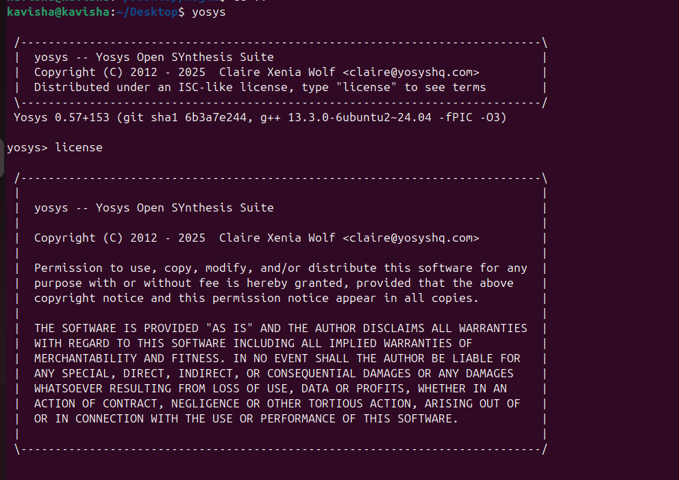

# Week 0: VLSI System Design (VSD) – Environment Setup

Welcome to the **VLSI System Design (VSD) program repository**!  
This week focuses on **setting up the foundation** for the entire VLSI workflow — from RTL synthesis to layout visualization. The goal is to prepare a **stable and functional environment** so that design, simulation, and layout tasks run smoothly.

---

## 🖥 System & Virtual Machine Setup

To run all the VLSI tools efficiently, I configured a **virtual machine** with the following specifications:

- **Operating System 🐧:** Ubuntu 24.04  
- **RAM 💾:** 6 GB  
- **Storage 💿:** 50 GB HDD  
- **vCPUs ⚡:** 4  

> 💡 *Tip:* This configuration ensures enough memory and CPU resources for compilation, simulation, and waveform visualization without slowdowns.

---

## ⚙ Tools Installed

This week I installed and verified the following **open-source VLSI tools**:

1. 🧠 **Yosys** – RTL synthesis  
2. 📟 **Icarus Verilog (iverilog)** – Verilog simulation  
3. 📊 **GTKWave** – Waveform analysis  
4. ⚡ **Ngspice** – Analog & mixed-signal circuit simulation  
5. 🎨 **Magic VLSI** – Layout design and visualization  

---

### 🧠 1. Yosys – RTL Synthesis

**Purpose:** Converts Verilog RTL into gate-level netlists and schematics.

**Installation:**
```bash
git clone https://github.com/YosysHQ/yosys.git
cd yosys
sudo apt install make
sudo apt install build-essential clang bison flex \
libreadline-dev gawk tcl-dev libffi-dev git \
graphviz xdot pkg-config python3 libboost-system-dev \
libboost-python-dev libboost-filesystem-dev zlib1g-dev -y

make config-gcc
git submodule update --init --recursive
make -j$(nproc)
sudo make install
Verification:

yosys -V



✅ Installed successfully

📟 2. Icarus Verilog

Purpose: Compile and run Verilog simulations for functional verification.

Installation:

sudo apt update
sudo apt install iverilog -y


Verification:

iverilog -V


✅ Installed successfully

📊 3. GTKWave

Purpose: Visualize simulation waveforms generated by Icarus Verilog.

Installation:

sudo apt update
sudo apt install gtkwave -y


Verification:

gtkwave --version


✅ Installed successfully

⚡ 4. Ngspice

Purpose: Simulate analog and mixed-signal circuits.

Installation:

sudo apt update
sudo apt install ngspice -y


Verification:

ngspice -v


✅ Installed successfully

🎨 5. Magic VLSI

Purpose: Create, edit, and analyze VLSI layouts with DRC and visualization support.

Installation:

sudo apt install m4 tcsh csh libx11-dev tcl-dev tk-dev \
libcairo2-dev mesa-common-dev libglu1-mesa-dev libncurses-dev -y

git clone https://github.com/RTimothyEdwards/magic
cd magic
./configure
make -j$(nproc)
sudo make install


Verification:

magic


✅ Installed successfully

🎯 Summary

All core tools for VLSI design, simulation, and visualization are now installed and working:

Tool	Status	Purpose
🧠 Yosys	✅	RTL Synthesis
📟 Icarus Verilog	✅	Functional Simulation
📊 GTKWave	✅	Waveform Viewer
⚡ Ngspice	✅	Analog Simulation
🎨 Magic VLSI	✅	Layout Design

🚀 Environment is ready for the VSD journey!

Repository: RTL2GDS_Alchemy
Author: TheVoltageVikingRam
Program: VLSI System Design (VSD)
